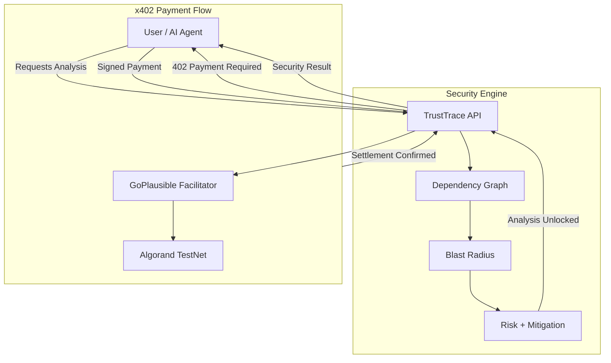

# TrustTrace
Traditional security tools tell you what is vulnerable. TrustTrace tells you what happens next.

## 1. The Problem
Modern applications consist of interconnected services. If one service is compromised, security teams need to understand the potential blast radius across dependencies, not merely identify the original vulnerable component.

## 2. The Solution
TrustTrace is a scenario-first cybersecurity intelligence platform that models application dependencies, simulates compromise scenarios, calculates potential blast radius, produces risk/severity information, and provides actionable mitigation guidance.

TrustTrace answers:
"What happens if this service is compromised?"

## 3. Live Demo
**Frontend:** [https://trust-trace-tawny.vercel.app](https://trust-trace-tawny.vercel.app)  
**Backend API:** [https://trusttrace-5kji.onrender.com](https://trusttrace-5kji.onrender.com)

**Main Demo Flow:**
The simulated architecture models: `Payment Service → Auth Service → Database Service`.
When you trigger a compromise simulation on the **Database Service**:
1. The dependency propagation engine calculates the impact across dependent services.
2. The affected services are highlighted in the interactive dependency graph.
3. The platform computes a risk score and generates actionable mitigation guidance.

## 4. Key Features
- Interactive dependency graph
- Scenario-based compromise simulation
- Blast-radius analysis
- Risk scoring
- Actionable mitigation recommendations
- Continuous discovery
- Real-time WebSocket updates
- Alerts
- Historical replay
- Agent-accessible security analysis
- x402 pay-per-analysis flow on Algorand TestNet

## 5. Architecture

- **Security engine:** Calculates the security result based on the dependency graph.
- **x402:** The HTTP payment protocol used to govern API access.
- **GoPlausible:** The facilitator that verifies the transaction.
- **Algorand:** The blockchain settlement network.
- **AI agent / client:** The payer requesting intelligence.
- **Security analysis:** The product being purchased.

## 6. How the x402 Flow Works
1. Client/agent requests the protected security analysis endpoint.
2. TrustTrace returns `HTTP 402 Payment Required` with machine-readable payment requirements.
3. Client selects the payment requirements.
4. Client constructs and signs the Algorand payment locally.
5. Signed payment proof is sent to TrustTrace.
6. TrustTrace uses the GoPlausible facilitator for payment verification and settlement.
7. Payment settles on Algorand TestNet.
8. TrustTrace unlocks and returns the protected security analysis with `HTTP 200 OK`.

*The private signing credential is used only by the local E2E client and is never deployed to the frontend, Vercel, Render, or committed to Git.*

## 7. LIVE PAYMENT PROOF
This transaction was generated by our verified E2E flow against the deployed backend and confirmed on the Algorand TestNet:

- **Network:** Algorand TestNet
- **Protocol:** x402
- **Scheme:** exact
- **Asset:** TestNet USDC (Asset 10458941)
- **Amount:** 1,000 micro-USDC (0.001 USDC)
- **Facilitator:** GoPlausible
- **Result:** `HTTP 402` → payment → settlement → `HTTP 200`
- **Confirmed transaction:** [WNPGDFLLTPJ5PZIQYNBZ5JR5QSKOMHI2XA7J7757A6ROAWDUR7PA](https://testnet.explorer.perawallet.app/tx/WNPGDFLLTPJ5PZIQYNBZ5JR5QSKOMHI2XA7J7757A6ROAWDUR7PA) *(Pera Explorer)* or [LORA Explorer](https://lora.algokit.io/testnet/transaction/WNPGDFLLTPJ5PZIQYNBZ5JR5QSKOMHI2XA7J7757A6ROAWDUR7PA)

## 8. x402 Code / Judge Inspection
For judges reviewing the x402 implementation, please inspect:
- `backend/app/x402_payment.py` (Backend x402 integration)
- `backend/tests/x402_e2e.py` (Local Agent/Client E2E execution)
- `frontend/package.json` and `frontend/package-lock.json`

The `@x402/avm` package is officially included as:
`"@x402/avm": "^2.25.0"`

## 9. Security Model
- Private signing credentials stay completely local to the E2E client.
- No mnemonic or private key is ever committed.
- Local `.env` files are ignored by version control.
- The public receiver address may be configured via safe environment variables in deployment.
- Invalid or fake payments are robustly rejected by the x402 implementation.
- The backend never receives the client's private key, only the cryptographic signature.

## 10. Honest Demo Scope
### Current Hackathon Scope
- The production dashboard is deployed and interactive.
- The real x402 E2E payment has been validated against the deployed backend.
- The actual cryptographic signing is currently performed by the local x402 Python client.
- The browser "Agentic Demo" represents the agentic payment experience visually; it does not independently sign the real transaction from the browser, enforcing strict private key security.
- Threat-feed events in the hackathon deployment are simulated to demonstrate the real-time event architecture.
- A production browser wallet integration could use a standard connection protocol (e.g., Pera Wallet Connect) in a future version.

## 11. Why x402 + Algorand?
TrustTrace is security intelligence. x402 makes that intelligence payable at the API/request level. Algorand provides the ultra-fast, low-cost blockchain settlement layer. This enables machine-to-machine and AI-agent pay-per-use access to security analysis without traditional billing overhead.

*We are not putting the dependency graph on blockchain. Blockchain is used strictly as the payment and settlement layer.*

## 12. Business / Startup Potential
- SaaS subscriptions for security teams
- Enterprise deployments
- API-based security intelligence
- Pay-per-analysis x402 access
- AI agents consuming security intelligence programmatically
- Integrations with DevSecOps/SOC/cloud/Kubernetes ecosystems

**Long term, TrustTrace can evolve from a cybersecurity dashboard into security-intelligence infrastructure that applications and AI agents consume programmatically.**

## 13. Technology Stack

| Layer | Technology |
|---|---|
| **Backend** | Python, FastAPI |
| **Graph** | NetworkX |
| **Database** | SQLite |
| **Realtime** | FastAPI WebSockets |
| **Frontend** | Next.js, React, Tailwind |
| **Blockchain** | Algorand TestNet |
| **Payments** | x402 |
| **Facilitator** | GoPlausible |

## 14. Local Setup
### Backend Setup
1. Navigate to the `backend` directory.
2. Create a virtual environment: `python -m venv .venv`
3. Activate it: `.\.venv\Scripts\activate` (Windows) or `source .venv/bin/activate` (Mac/Linux)
4. Install dependencies: `pip install -r requirements.txt`
5. Run the server: `python -m uvicorn app.main:app --reload --port 8000`

### Frontend Setup
1. Navigate to the `frontend` directory.
2. Install dependencies: `npm install`
3. Start the development server: `npm run dev`

### Local E2E Client (x402)
1. Configure your local `.env` with a funded Algorand TestNet mnemonic (`X402_CLIENT_MNEMONIC`) and its corresponding public address (`AVM_ADDRESS`).
2. Run the client: `python backend/tests/x402_e2e.py`
3. *Note: The E2E client performs a real TestNet transaction. The signing credential remains local-only and is never exposed.*

## 15. For Judges
1. Open the [live dashboard](https://trust-trace-tawny.vercel.app).
2. Select **Database Service**.
3. Run **Simulate Compromise**.
4. Observe the blast radius, risk score, and mitigation advice.
5. Inspect the x402 implementation in `backend/app/x402_payment.py`.
6. Inspect `frontend/package.json` for `@x402/avm`.
7. Inspect `backend/tests/x402_e2e.py`.
8. Verify the real TestNet transaction using the ID provided in section 7.

## 16. Final Positioning
TrustTrace turns application dependencies into attack-impact intelligence and makes that intelligence accessible to software agents through a pay-per-use x402 API.

